# ETL Pipeline с инкрементальной загрузкой  
### MongoDB → PostgreSQL DWH → Аналитические витрины (Apache Airflow)

---

# Описание проекта

В данном проекте реализован **ETL‑pipeline с инкрементальной загрузкой данных**, который извлекает данные из **MongoDB**, загружает их в **PostgreSQL Data Warehouse**, а затем формирует **аналитические витрины данных**.

Оркестрация всех ETL процессов выполняется с помощью **Apache Airflow**.

Архитектура проекта включает в себя:

- извлечение данных из операционной базы данных
- инкрементальную загрузку данных
- многоуровневую архитектуру хранилища данных
- оркестрацию ETL процессов
- построение аналитических витрин

---

# Архитектура решения

ETL pipeline состоит из следующих компонентов:

MongoDB  
↓  
Airflow DAG `mongo_incremental_etl`  
↓  
PostgreSQL (staging → dwh)  
↓  
Airflow DAG `build_analytics_marts`  
↓  
Аналитические витрины (mart)

---

# Используемые технологии

| Компонент | Технология |
|--------|--------|
| Source DB | MongoDB |
| Data Warehouse | PostgreSQL |
| Оркестрация | Apache Airflow |
| Инфраструктура | Docker + Docker Compose |
| Среда разработки | WSL2 |

---

# Архитектура Data Warehouse

В базе данных используется **многоуровневая архитектура хранилища данных**.

Схемы:

staging  
dwh  
mart  
meta  

---

# Слой staging

Слой **staging** содержит сырые данные, извлеченные из MongoDB.

Таблицы:

staging.user_sessions_raw  
staging.event_logs_raw  
staging.support_tickets_raw  

Каждая загрузка помечается **batch_id**, что позволяет отслеживать отдельные загрузки.

Пример batch загрузок:

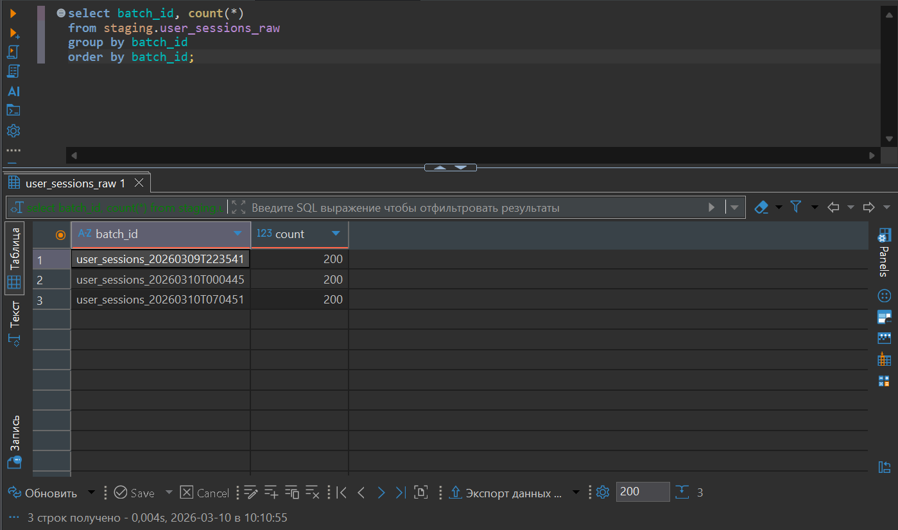

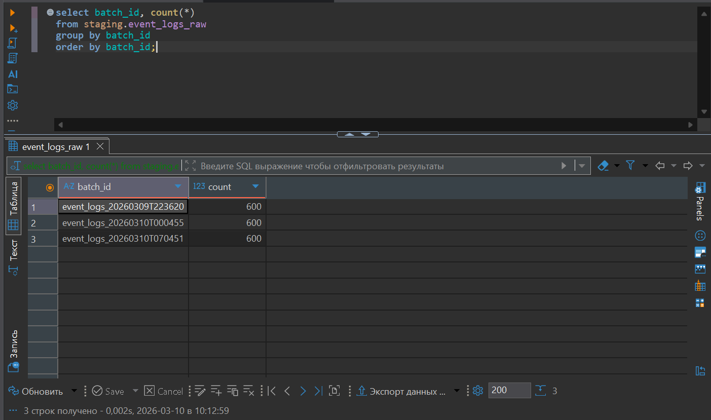

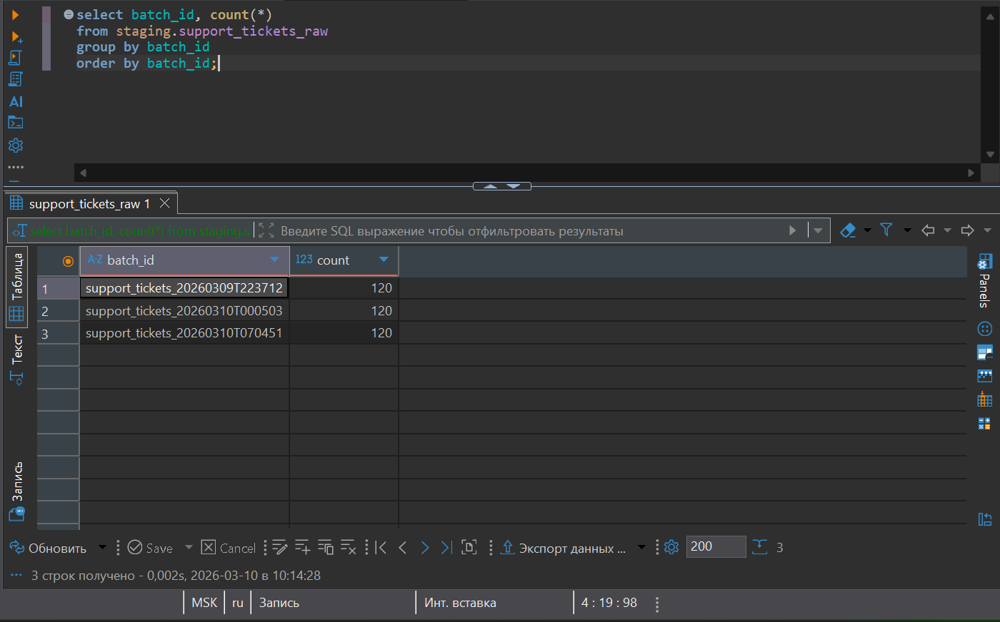

---

# Слой DWH

Слой **dwh** содержит очищенные и нормализованные данные.

Таблицы:

dwh.user_sessions  
dwh.session_pages  
dwh.session_actions  
dwh.event_logs  
dwh.support_tickets  
dwh.ticket_messages  

Примеры объема данных:

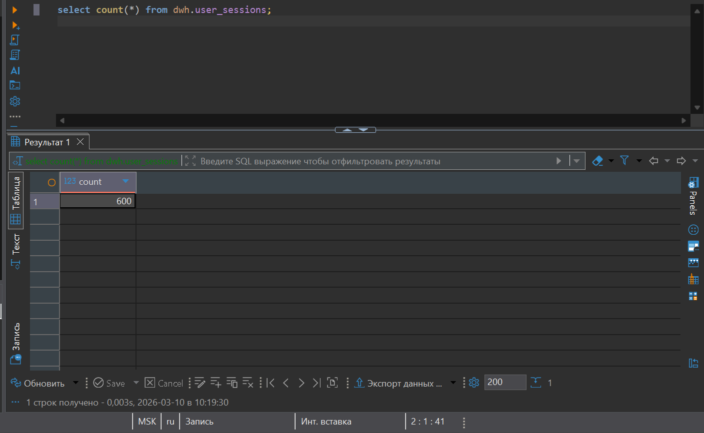

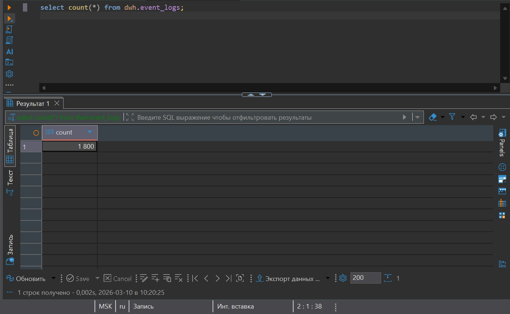

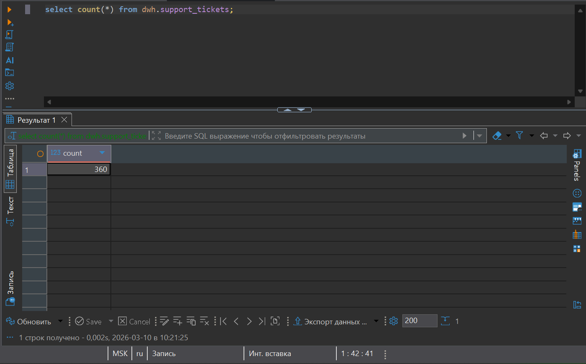

---

# Слой аналитических витрин (mart)

Слой **mart** предназначен для аналитических запросов.

Витрины:

mart.user_activity  
mart.support_efficiency  

Назначение витрин:

**user_activity** — агрегированная информация о пользовательской активности.

**support_efficiency** — метрики эффективности службы поддержки.

---

# Инкрементальная загрузка данных

Для реализации incremental ETL используется механизм **watermarks**.

Информация о последней обработанной записи хранится в таблице:

meta.etl_watermarks

Пример содержимого:

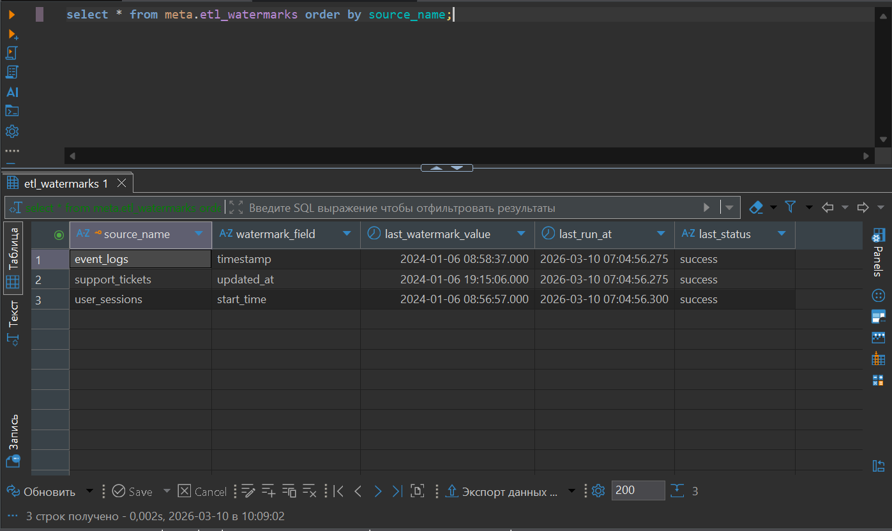

При следующем запуске ETL извлекаются только новые записи.

Пример логики:

SELECT *
FROM source
WHERE timestamp > last_watermark

Это позволяет:

- избежать повторной обработки данных
- уменьшить нагрузку на систему
- ускорить ETL pipeline

---

# Airflow DAG: инкрементальный ETL

DAG:

mongo_incremental_etl

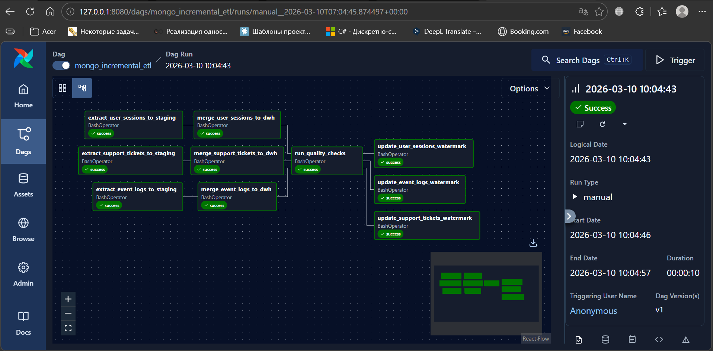

Pipeline состоит из следующих этапов:

1. извлечение данных из MongoDB
2. загрузка в staging
3. merge данных в DWH
4. выполнение проверок качества данных
5. обновление watermark

---

# DAG построения витрин

DAG:

build_analytics_marts

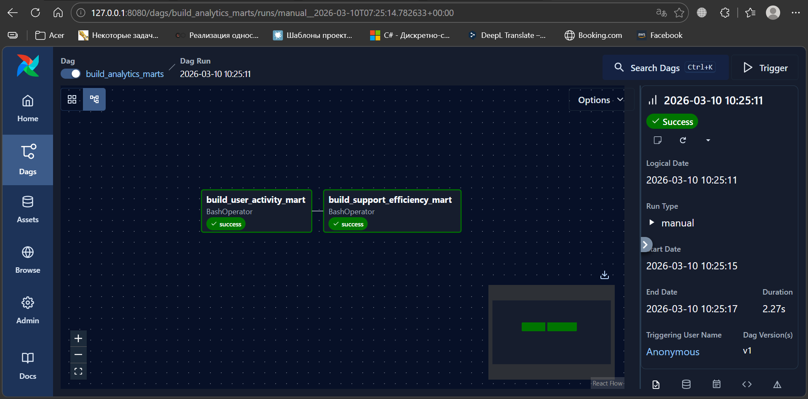

Задачи DAG:

build_user_activity_mart  
build_support_efficiency_mart  

---

# Примеры аналитических запросов

## Среднее время решения обращений

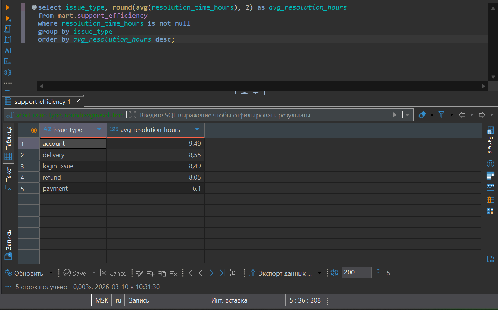

---

## Распределение тикетов по статусам

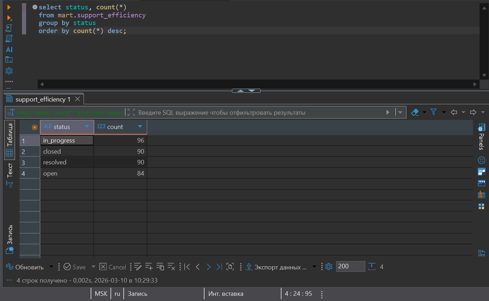

---

## Предпочитаемые устройства пользователей

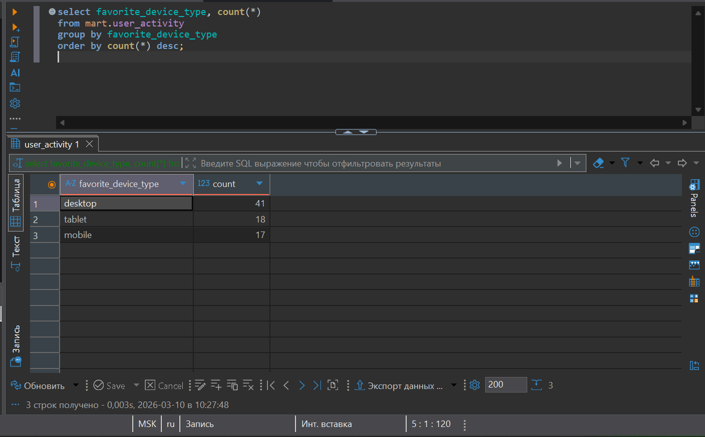

---

# Data Quality проверки

В процессе ETL выполняются проверки качества данных:

- проверка количества загруженных строк
- проверка наличия дубликатов
- контроль корректности загрузки batch

Эти проверки выполняются в задаче:

run_quality_checks

---

# Структура проекта

project  
│  
├── dags  
│   ├── mongo_incremental_etl.py  
│   └── build_analytics_marts.py  
│  
├── scripts  
├── sql  
├── screenshots  
├── docker-compose.yml  
└── README.md  

---

# Запуск проекта

Запуск инфраструктуры:

docker compose up -d

Airflow UI:

http://localhost:8080

Запуск ETL pipeline:

mongo_incremental_etl

Построение аналитических витрин:

build_analytics_marts
