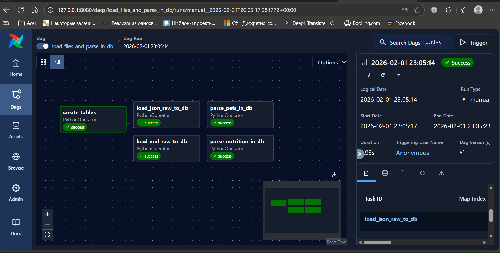
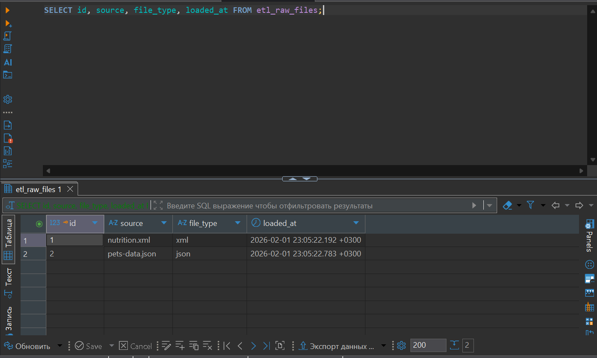
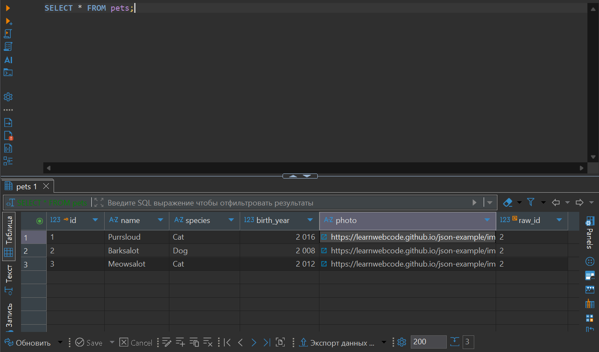
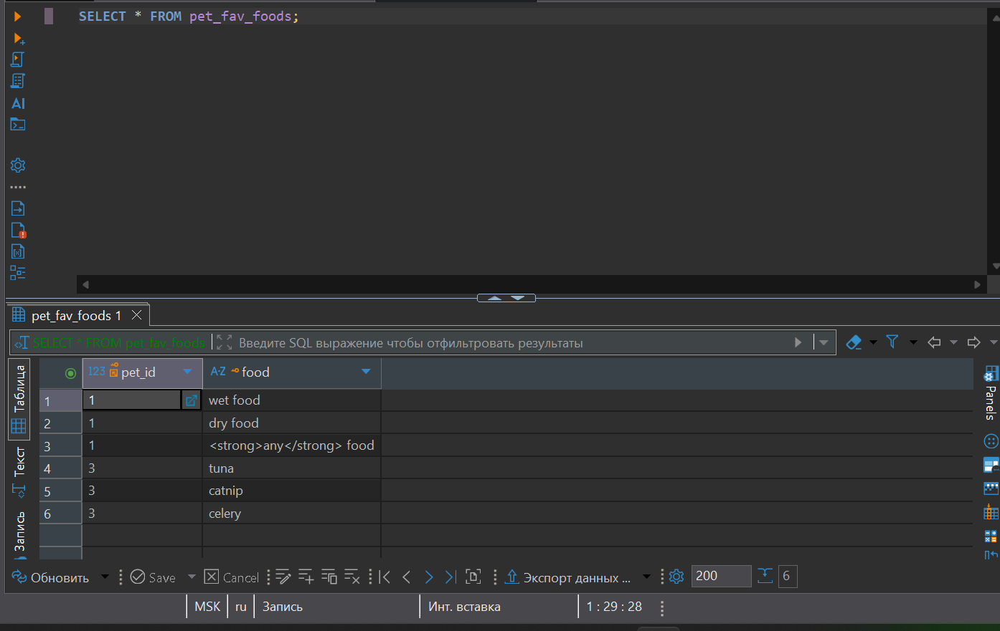
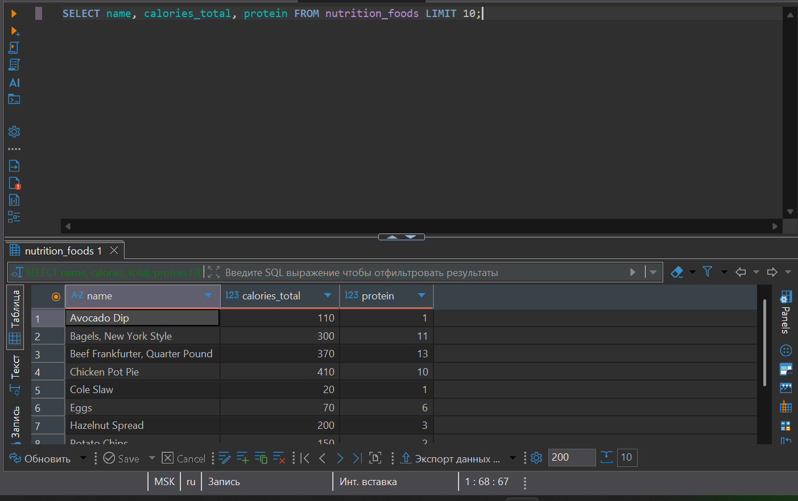

**Выполнил:**  
Орешко Владислав Андреевич  

# ETL: загрузка JSON и XML в PostgreSQL через Apache Airflow

## Цель задания
Реализовать ETL‑процесс на **Apache Airflow**, который:
1. Загружает сырые данные из файлов **JSON** и **XML**.
2. Сохраняет их в staging‑таблицу в **PostgreSQL**.
3. Парсит данные и раскладывает их по нормализованным таблицам.
4. Корректно отрабатывает DAG целиком (все задачи в статусе *Success*).

---

## Используемые технологии
- **Apache Airflow 3.x** (LocalExecutor)
- **PostgreSQL 15**
- **Docker / docker‑compose**
- **Python 3.12**

---

## Структура проекта
```text
.
├── dags/                # DAG и SQL‑логика
│   └── dag.py
├── data/                # Исходные файлы
│   ├── pets-data.json
│   └── nutrition.xml
├── logs/                # Логи Airflow
├── screenshots/         # Скриншоты выполнения задания
│   ├── complete_dag.png
│   ├── complete_files_query.png
│   ├── complete_pets_query.png
│   ├── complete_pet_fav_food_query.png
│   └── complete_nutrition_foods_query.png
├── docker-compose.yml
├── requirements.txt
└── README.md
```

---

## Описание DAG
DAG **`load_files_and_parse_in_db`** состоит из следующих задач:

1. **create_tables** — создание всех необходимых таблиц.
2. **load_json_raw_to_db** — загрузка JSON (`pets-data.json`) в staging‑таблицу `etl_raw_files`.
3. **load_xml_raw_to_db** — загрузка XML (`nutrition.xml`) в staging‑таблицу `etl_raw_files`.
4. **parse_pets_in_db** — парсинг JSON в таблицы `pets` и `pet_fav_foods`.
5. **parse_nutrition_in_db** — парсинг XML в таблицу `nutrition_foods`.

Зависимости:
- `create_tables → load_json_raw → parse_pets_in_db`
- `create_tables → load_xml_raw → parse_nutrition_in_db`

### Граф DAG


---

## Проверка загрузки данных

### Staging‑таблица (`etl_raw_files`)
Проверка, что оба файла были загружены:

```sql
SELECT id, source, file_type, loaded_at
FROM etl_raw_files;
```



---

### Таблица `pets`

```sql
SELECT * FROM pets;
```



---

### Таблица `pet_fav_foods`

```sql
SELECT * FROM pet_fav_foods;
```



---

### Таблица `nutrition_foods`

```sql
SELECT name, calories_total, protein
FROM nutrition_foods
LIMIT 10;
```



---

## Результат
- Все задачи DAG успешно выполняются.
- JSON и XML корректно загружаются и парсятся.
- Данные сохранены в нормализованном виде в PostgreSQL.
- Результат подтверждён SQL‑запросами и скриншотами.

---

## Примечания
- DAG можно перезапускать многократно — дубликаты не создаются за счёт `ON CONFLICT DO NOTHING`.
- Все скриншоты находятся в папке `screenshots/` и приложены в README согласно требованиям задания.

