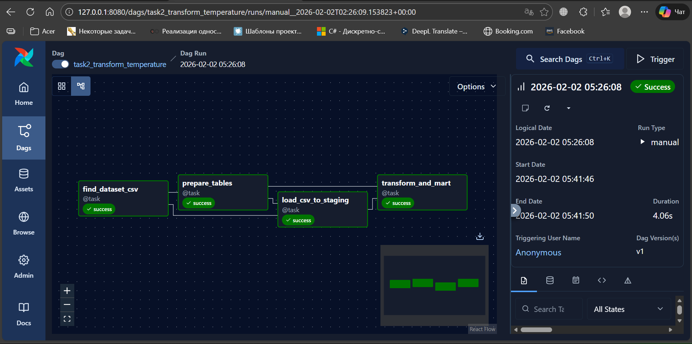
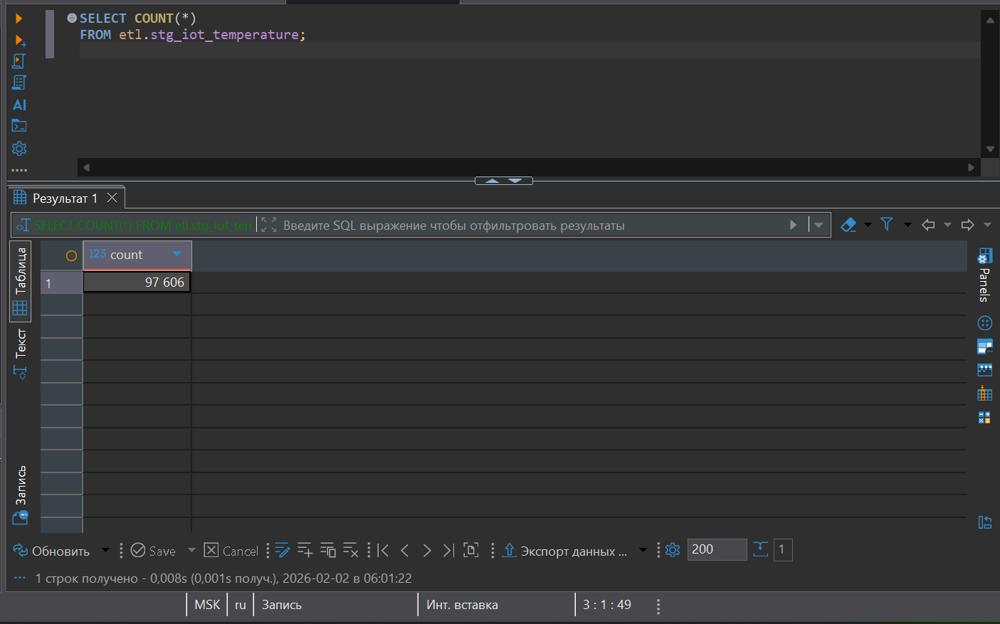
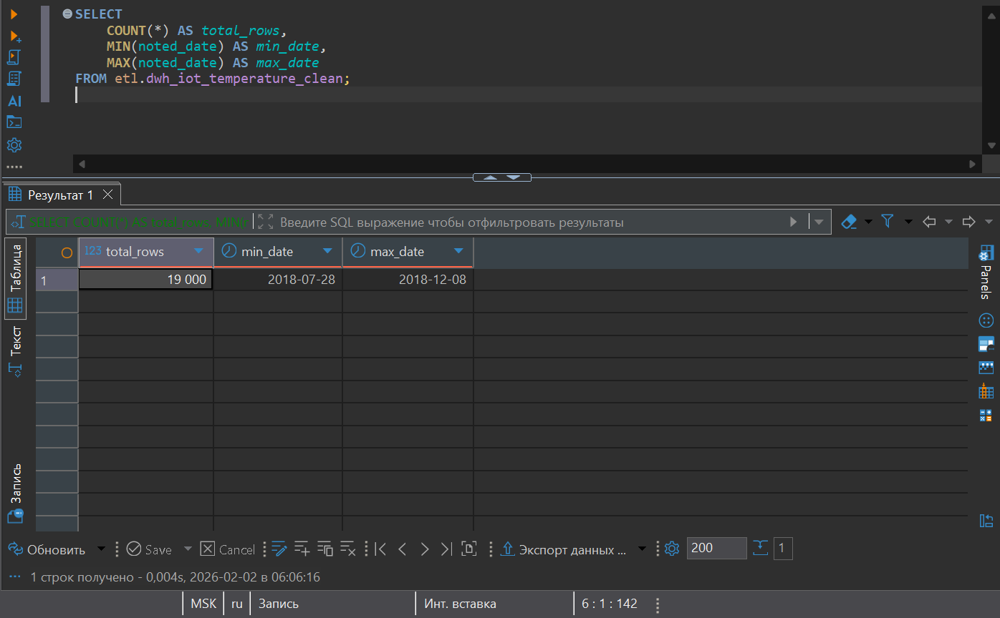
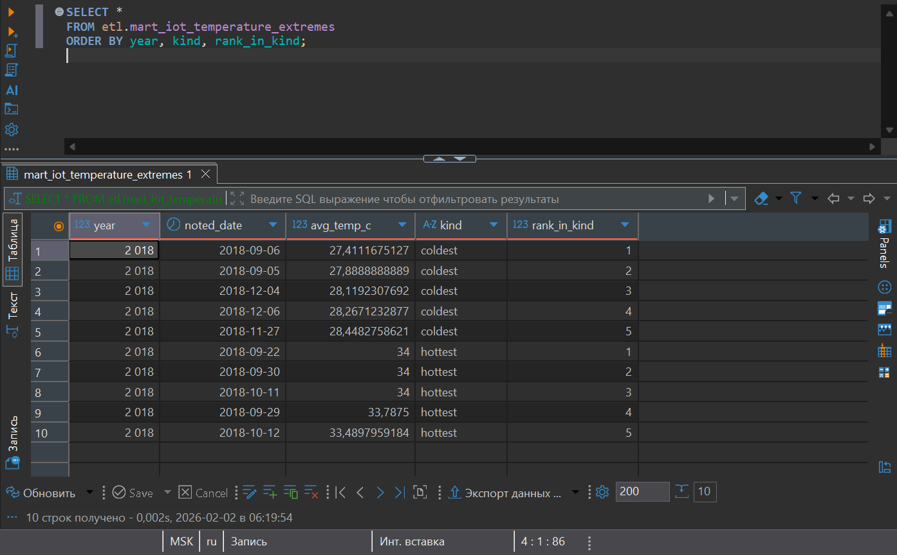

**Выполнил:**  
Орешко Владислав Андреевич  

# ETL: трансформация температурных данных (CSV → DWH → MART) через Apache Airflow

## Цель задания
Реализовать ETL-процесс на **Apache Airflow**, который:
1. Загружает исходные данные из **CSV-файла** с показаниями температур.
2. Сохраняет сырые данные в staging-таблицу в **PostgreSQL**.
3. Выполняет очистку и трансформацию данных (DWH-слой).
4. Формирует витрину (MART) с:
   - 5 самыми холодными днями года  
   - 5 самыми жаркими днями года
5. Корректно отрабатывает DAG целиком (все задачи в статусе *Success*).

---

## Используемые технологии
- **Apache Airflow 3.x** (LocalExecutor)
- **PostgreSQL 15**
- **Docker / docker-compose**
- **Python 3.12**

---

## Структура проекта
```text
.
├── dags/
│   └── task2_transform_temperature.py
├── data/
│   └── IOT-temp.csv
├── initdb/
├── logs/
├── screenshots/
│   ├── complete_dag.png
│   └── complete_select_query.png
├── .env
├── docker-compose.yml
├── .gitignore
└── README.md
```

---

## Описание DAG
DAG **`task2_transform_temperature`** состоит из следующих задач:

1. **find_dataset_csv** — поиск CSV-файла с датасетом.
2. **prepare_tables** — создание схемы и таблиц (staging, DWH, MART).
3. **load_csv_to_staging** — загрузка CSV в staging через COPY.
4. **transform_and_mart** — очистка данных и формирование витрины.

Зависимости задач:
```
find_dataset_csv → prepare_tables → load_csv_to_staging → transform_and_mart
```

### Граф DAG


---

## Проверка загрузки и трансформации данных

### Staging (`etl.stg_iot_temperature`)

#### Проверка, что данные успешно загружены:

```sql
SELECT COUNT(*) FROM etl.stg_iot_temperature;
```



---

### DWH (`etl.dwh_iot_temperature_clean`)

#### Проверка количества строк и диапазона дат:

```sql
SELECT COUNT(*), MIN(noted_date), MAX(noted_date)
FROM etl.dwh_iot_temperature_clean;
```



---

### MART (`etl.mart_iot_temperature_extremes`)

#### Проверка витрины экстремальных температур:

```sql
SELECT *
FROM etl.mart_iot_temperature_extremes
ORDER BY year, kind, rank_in_kind;
```



---

## Результат
- Все задачи DAG успешно выполнены.
- CSV-данные загружены и очищены.
- Сформирована витрина экстремальных температур.
- Результат подтверждён SQL-запросами и скриншотами.

---

## Примечания
- DAG идемпотентен (таблицы очищаются при перезапуске).
- Все скриншоты приложены в папке `screenshots/`.
