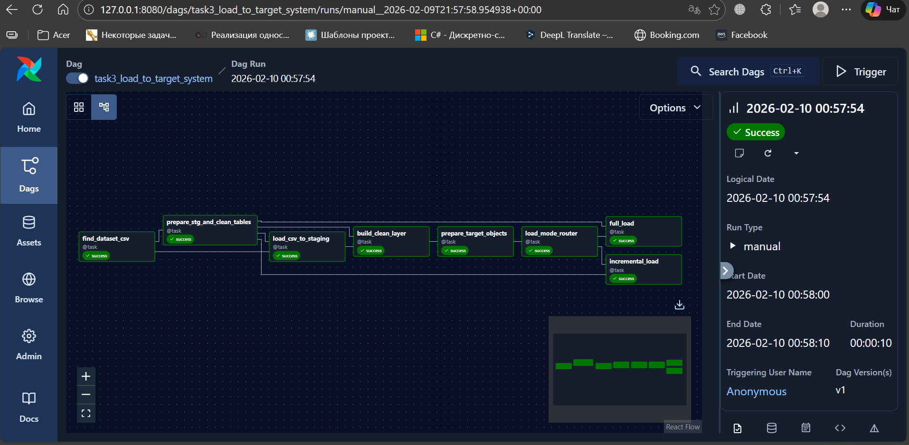
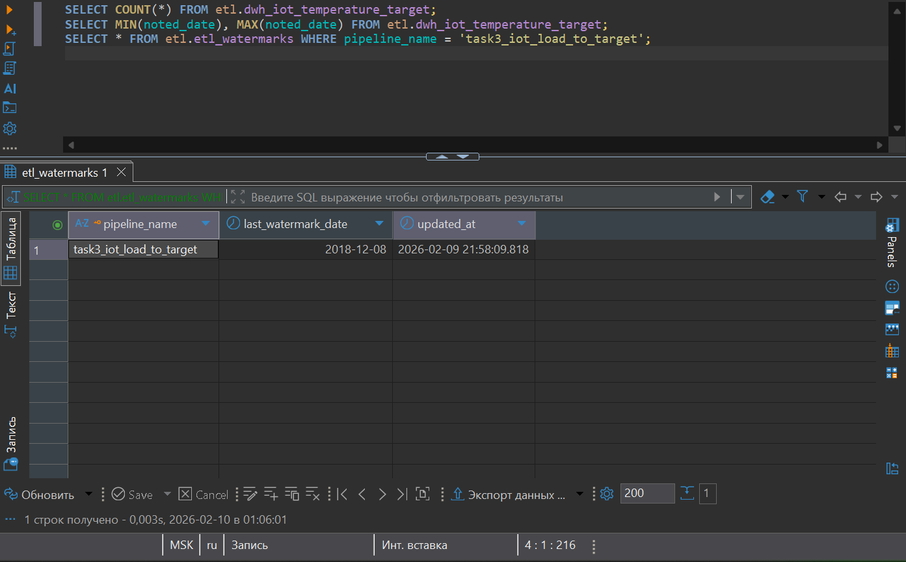
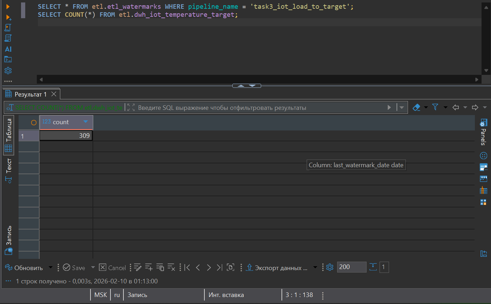

**Выполнил:**\
Орешко Владислав Андреевич

# ETL: загрузка температурных данных в целевую систему (Full + Incremental) через Apache Airflow

## Цель задания

Реализовать ETL-процесс на **Apache Airflow**, который:

1.  Использует результат трансформации данных (clean-слой).
2.  Реализует два процесса загрузки в целевую таблицу:
    -   **Full load** --- полная загрузка исторических данных.
    -   **Incremental load** --- загрузка только новых/изменённых данных
        за последние дни.
3.  Использует механизм **watermark** для отслеживания последней
    загруженной даты.
4.  Корректно отрабатывает DAG целиком (все задачи в статусе *Success*).

------------------------------------------------------------------------

## Используемые технологии

-   **Apache Airflow 3.x** (LocalExecutor)\
-   **PostgreSQL 15**\
-   **Docker / docker-compose**\
-   **Python 3.12**

------------------------------------------------------------------------

## Структура проекта

``` text
.
├── dags/
│   └── task3_load_to_target_system.py
├── data/
│   └── IOT-temp.csv
├── initdb/
├── logs/
├── screenshots/
│   ├── complete_dag.png
│   ├── complete_full_load.png
│   └── complete_incremental_load.png
├── .env
├── docker-compose.yml
├── .gitignore
└── README.md
```

------------------------------------------------------------------------

## Архитектура загрузки

### 1. Подготовительный слой (повторяет трансформацию из ДЗ2)

-   `find_dataset_csv` --- поиск CSV-файла.
-   `prepare_stg_and_clean_tables` --- создание staging и DWH-таблиц.
-   `load_csv_to_staging` --- загрузка CSV в staging.
-   `build_clean_layer` --- очистка данных:
    -   фильтрация `outin = 'in'`
    -   преобразование строки даты в `DATE`
    -   фильтрация выбросов (5 и 95 перцентиль)

------------------------------------------------------------------------

### 2. Подготовка целевого слоя

-   `prepare_target_objects` --- создание:
    -   `etl.dwh_iot_temperature_target`
    -   `etl.etl_watermarks`

------------------------------------------------------------------------

### 3. Загрузка в целевую систему

-   `load_mode_router` --- выбор режима загрузки.
-   `full_load` --- полная загрузка данных:
    -   `TRUNCATE target`
    -   вставка всех данных из clean
    -   обновление watermark (max(noted_date))
-   `incremental_load` --- инкрементальная загрузка:
    -   чтение `last_watermark_date`
    -   загрузка данных с учётом lookback-окна
    -   `INSERT ... ON CONFLICT DO NOTHING`
    -   обновление watermark

------------------------------------------------------------------------

### Граф DAG


------------------------------------------------------------------------

## Проверка Full Load

``` sql
SELECT COUNT(*) 
FROM etl.dwh_iot_temperature_target;

SELECT MIN(noted_date), MAX(noted_date)
FROM etl.dwh_iot_temperature_target;

SELECT *
FROM etl.etl_watermarks
WHERE pipeline_name = 'task3_iot_load_to_target';
```


------------------------------------------------------------------------

## Проверка Incremental Load

``` sql
SELECT *
FROM etl.etl_watermarks
WHERE pipeline_name = 'task3_iot_load_to_target';

SELECT COUNT(*)
FROM etl.dwh_iot_temperature_target;
```


------------------------------------------------------------------------

## Реализованная логика incremental

-   Используется таблица `etl.etl_watermarks`
-   Хранится:
    -   `pipeline_name`
    -   `last_watermark_date`
    -   `updated_at`
-   Загрузка выполняется только для дат: noted_date \>=
    last_watermark_date - lookback_days
-   Используется идемпотентная вставка: INSERT ... ON CONFLICT DO
    NOTHING

------------------------------------------------------------------------

## Результат

-   Реализована полная загрузка исторических данных.
-   Реализована инкрементальная загрузка с использованием watermark.
-   DAG полностью воспроизводим (не зависит от сохранённых volume).
-   Все этапы подтверждены SQL-проверками и скриншотами.

------------------------------------------------------------------------

## Примечания

-   DAG самодостаточный: при удалении volumes все таблицы пересоздаются.
-   Инкрементальная загрузка защищена от дубликатов.
-   Решение соответствует требованиям задания.
