# Задание 4 – Работа с Big Data и NoSQL в ETL-процессах

> **Скриншоты** всех шагов находятся в папке [`screenshots/`](./screenshots/)

**Курс:** ETL-процессы · ВШЭ 
**Автор:** Владислав Орешко  
**Тема датасета:** IoT-датчики мониторинга окружающей среды (города России)

---

## Содержание

- [Описание задания](#описание-задания)
- [Часть 1 – Вебинар 11: Big Data с Yandex Data Processing](#часть-1--вебинар-11-big-data-с-yandex-data-processing)
- [Часть 2 – Вебинар 12: NoSQL в ETL — Kafka → StoreDoc](#часть-2--вебинар-12-nosql-в-etl--kafka--storedoc)
- [Удаление ресурсов](#удаление-ресурсов)
- [Структура репозитория](#структура-репозитория)

---

## Описание задания

Задание охватывает два вебинара:

| Вебинар | Тема | Ключевые сервисы |
|---------|------|-----------------|
| 11 | Big Data — распределённая обработка JSON с помощью Spark | Yandex Data Processing, Object Storage (S3) |
| 12 | NoSQL в ETL — потоковая передача данных из Kafka в MongoDB-совместимое хранилище | Managed Service for Kafka, Yandex StoreDoc, Data Transfer |

**Исходный датасет:** `data/sensors.json` — массив из 5 объектов IoT-метеостанций. Каждый объект содержит два вложенных массива: `readings` (показания сенсоров) и `alerts` (предупреждения). ETL-пайплайн разворачивает их в две отдельные плоские таблицы с помощью `F.explode()`.

---

## Часть 1 – Вебинар 11: Big Data с Yandex Data Processing

### Архитектура

```
Object Storage (S3)           Yandex Data Processing          Object Storage (S3)
┌──────────────────┐          ┌──────────────────────────┐    ┌──────────────────────┐
│  sensors.json    │──чтение─▶│  Hadoop + Spark кластер  │───▶│  readings.parquet/   │
│  (multiline)     │          │  spark_etl.py            │    │  alerts.parquet/     │
└──────────────────┘          └──────────────────────────┘    └──────────────────────┘
```

### Скриншоты

| № | Скриншот | Описание |
|---|----------|----------|
| 01 | 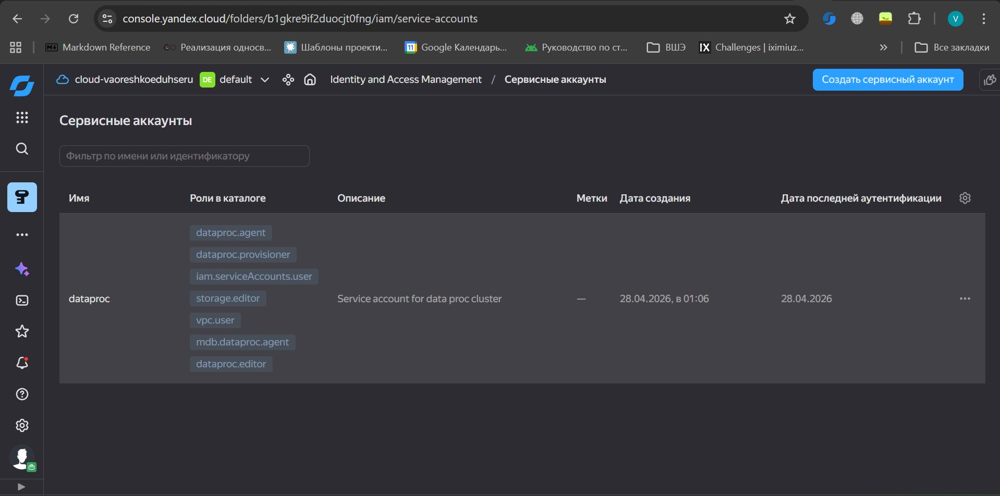 | Сервисный аккаунт `dataproc` с необходимыми ролями |
| 02 | 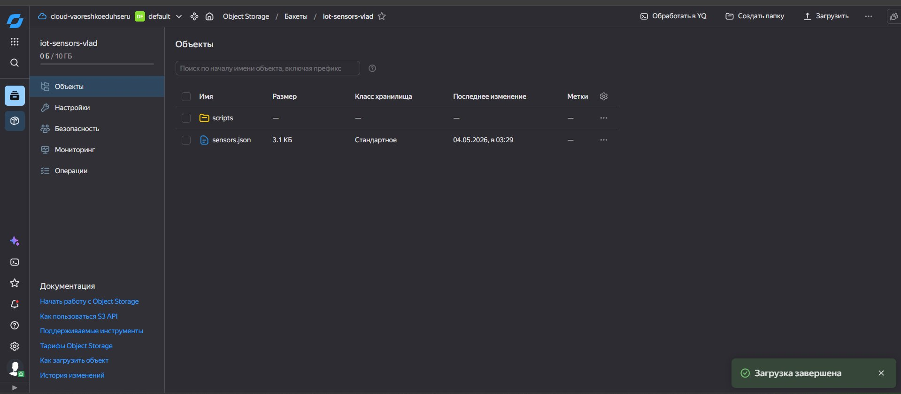 | S3 бакет с загруженными `sensors.json` и папкой `scripts/` |
| 03 | 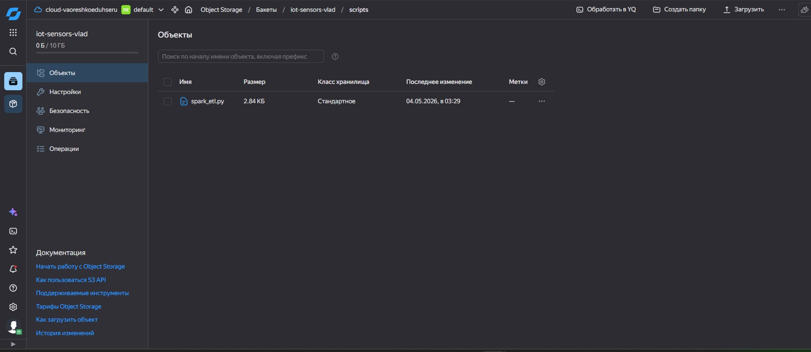 | Скрипт `spark_etl.py` в папке `scripts/` |
| 04 | 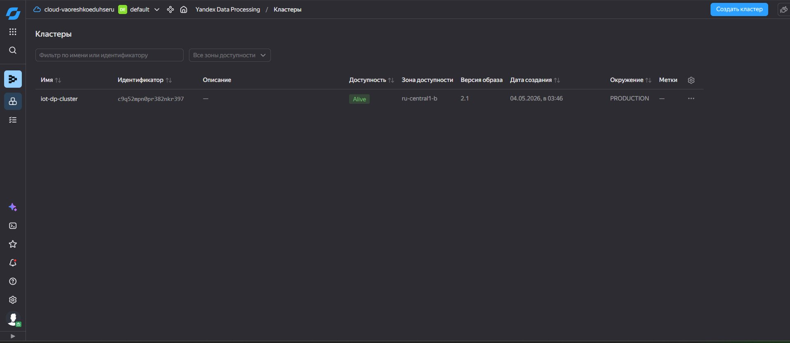 | Кластер Data Processing — статус **Alive** |
| 05 | 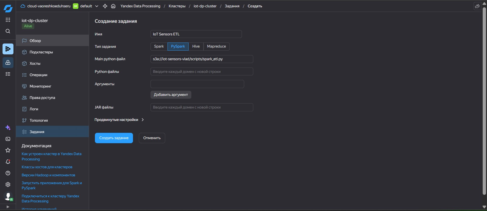 | Форма создания PySpark задания |
| 06 | 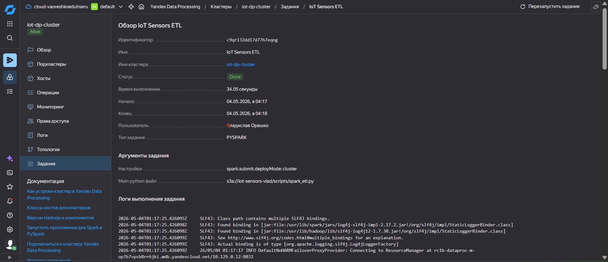 | Задание выполнено — статус **Done** (34 секунды) |
| 07 | 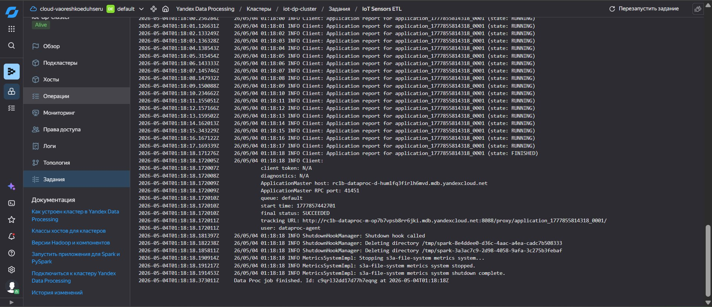 | Логи задания — `final status: SUCCEEDED` |
| 08 | 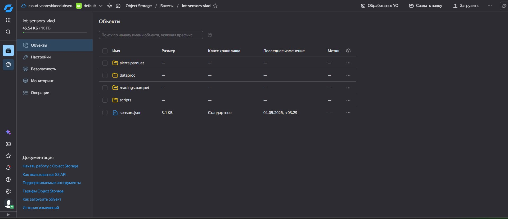 | S3 бакет — появились папки `alerts.parquet/` и `readings.parquet/` |
| 09 | 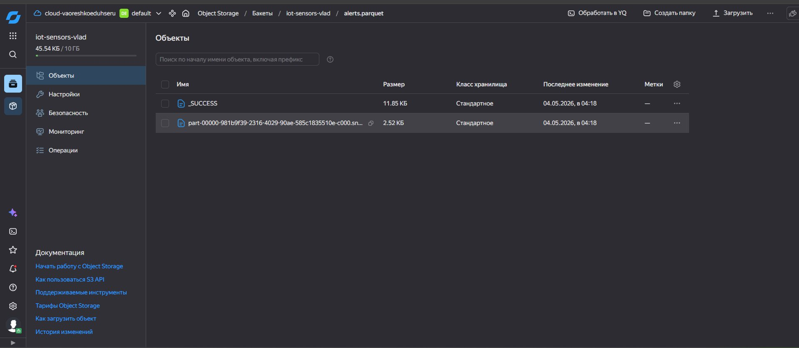 | Содержимое `alerts.parquet/` — файл `.snappy.parquet` |
| 10 | 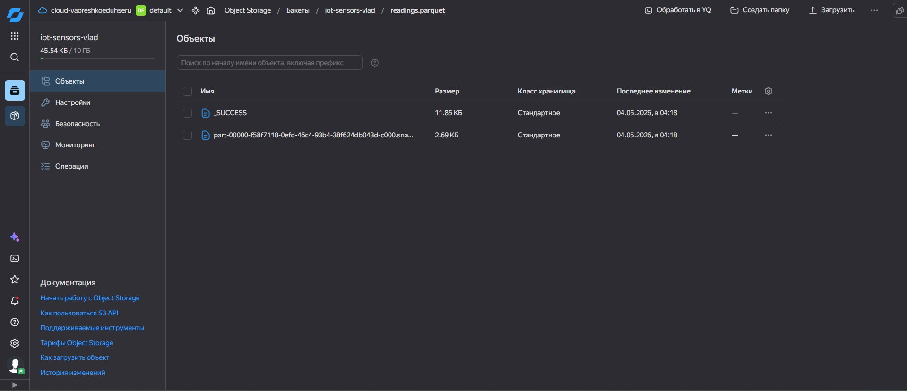 | Содержимое `readings.parquet/` — файл `.snappy.parquet` |

### Шаг 1 – Создание сервисного аккаунта и настройка сети

Сервисный аккаунт `dataproc` создан заранее с ролями: `dataproc.agent`, `dataproc.provisioner`, `dataproc.editor`, `storage.editor`, `vpc.user`, `iam.serviceAccounts.user`, `mdb.dataproc.agent`.

Сеть `default` с подсетью в зоне `ru-central1-b` имеет таблицу маршрутизации с NAT-шлюзом — необходима для выхода кластера в интернет.

### Шаг 2 – Загрузка данных в Object Storage

Создан бакет `iot-sensors-vlad`. В него загружены `sensors.json` в корень и `spark_etl.py` в папку `scripts/`.

**Исходные данные (`sensors.json`) — до ETL:**

```json
[
  {
    "station_id": "iot-msk-001",
    "location": "Moscow, Arbat district",
    "datetime": "2024-11-10 06:00:00",
    "readings": [
      {"sensor_type": "temperature", "value": -2.5, "unit": "C", "status": "ok"},
      {"sensor_type": "humidity",    "value": 82.3, "unit": "%", "status": "ok"},
      {"sensor_type": "pressure",    "value": 1018.4, "unit": "hPa", "status": "ok"},
      {"sensor_type": "wind_speed",  "value": 5.1, "unit": "m/s", "status": "ok"}
    ],
    "alerts": [
      {"level": "info", "code": "A001", "message": "Normal operation"}
    ]
  }
  ...всего 5 станций...
]
```

### Шаг 3 – Создание кластера Data Processing

| Параметр | Значение |
|----------|---------|
| Имя | `iot-dp-cluster` |
| Версия образа | `2.1` (Hadoop 3.x + Spark 3.x) |
| Сервисы | HDFS, YARN, Spark, Livy |
| Мастер и Data хосты | `c3-c2-m4` (2 vCPU, 4 ГБ) |
| Бакет | `iot-sensors-vlad` |
| Сервисный аккаунт | `dataproc` |
| Зона доступности | `ru-central1-b` |

### Шаг 4 – Запуск PySpark задания

Тип задания **PySpark**, основной файл: `s3a://iot-sensors-vlad/scripts/spark_etl.py`.

Скрипт читает `sensors.json`, применяет `F.explode()` к массивам `readings` и `alerts`, затем записывает два Parquet-датасета обратно в S3:

```python
df = spark.read.option("multiline", "true").json("s3a://iot-sensors-vlad/sensors.json")

readings = df.select("station_id", "location", "datetime",
                     F.explode("readings").alias("r")).select(
    "station_id", "location", "datetime",
    F.col("r.sensor_type"), F.col("r.value"), F.col("r.unit"), F.col("r.status"))

alerts = df.select("station_id", "location", "datetime",
                   F.explode("alerts").alias("a")).select(
    "station_id", "location", "datetime",
    F.col("a.level"), F.col("a.code"), F.col("a.message"))

readings.write.mode("overwrite").parquet("s3a://iot-sensors-vlad/readings.parquet")
alerts.write.mode("overwrite").parquet("s3a://iot-sensors-vlad/alerts.parquet")
```

### Шаг 5 – Проверка результата в S3

После выполнения задания в бакете появились папки с Parquet-файлами:

**readings.parquet** — 20 строк (5 станций × 4 сенсора), пример:

| station_id | sensor_type | value | unit | status |
|---|---|---|---|---|
| iot-msk-001 | temperature | -2.5 | C | ok |
| iot-spb-001 | wind_speed | 12.6 | m/s | critical |

**alerts.parquet** — 8 строк, пример:

| station_id | alert_level | alert_code | alert_message |
|---|---|---|---|
| iot-msk-002 | warning | A002 | Pressure drop detected |
| iot-spb-001 | critical | A003 | Wind speed exceeds 12 m/s |

---

## Часть 2 – Вебинар 12: NoSQL в ETL — Kafka → StoreDoc

Документация: [Yandex Cloud — Поставка данных из Kafka в StoreDoc](https://yandex.cloud/ru/docs/tutorials/dataplatform/data-transfer-mkf-mmg)

### Архитектура

```
kafka_producer.py          Managed Kafka            Yandex Data Transfer      Yandex StoreDoc
┌──────────────────┐       ┌─────────────┐          ┌──────────────────┐      ┌──────────────┐
│  IoT JSON        │──────▶│  топик:     │─────────▶│  Трансфер        │─────▶│  коллекция:  │
│  сообщения       │       │  sensors    │          │  kafka→storedoc  │      │  sensors     │
└──────────────────┘       └─────────────┘          └──────────────────┘      └──────────────┘
```

### Скриншоты

| № | Скриншот | Описание |
|---|----------|----------|
| 11 | 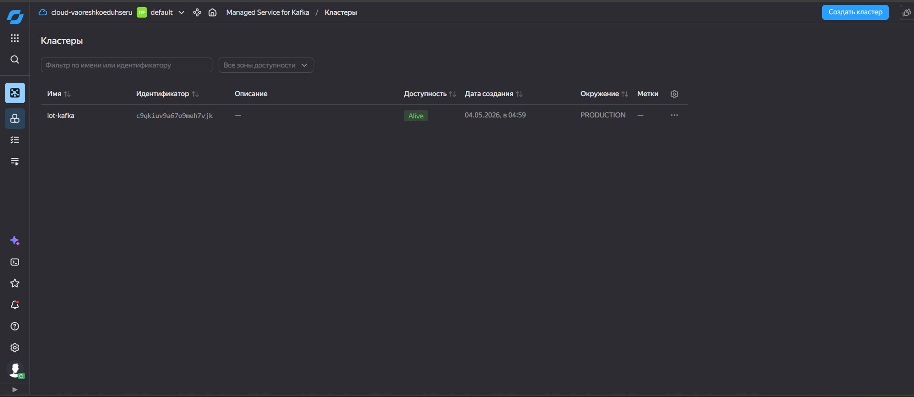 | Кластер Kafka — статус **Alive** |
| 12 | 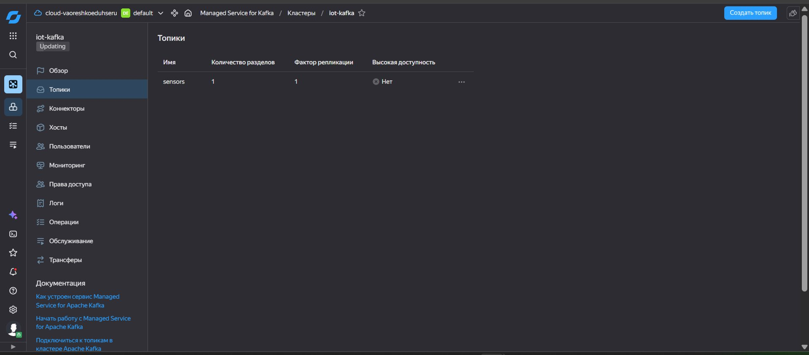 | Топик `sensors` создан (1 раздел, репликация 1) |
| 13 | 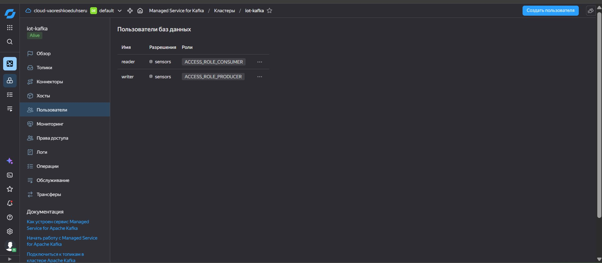 | Пользователи `writer` (PRODUCER) и `reader` (CONSUMER) |
| 14 | 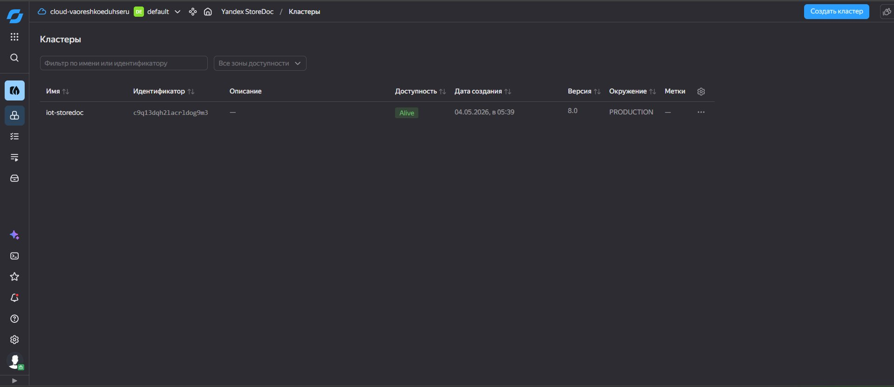 | Кластер StoreDoc — статус **Alive** |
| 15 | 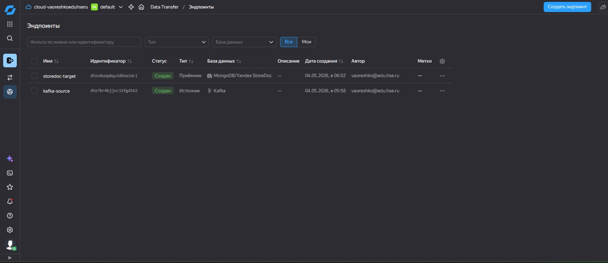 | Оба эндпоинта созданы: `kafka-source` и `storedoc-target` |
| 16 | 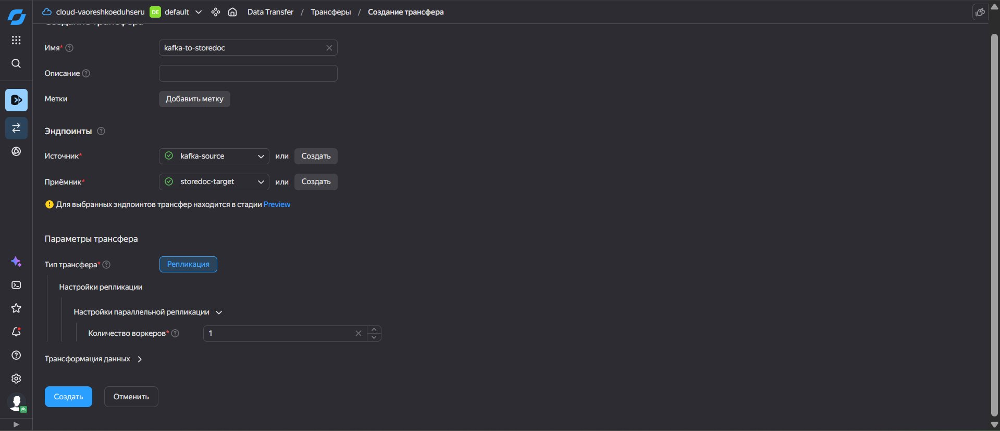 | Форма создания трансфера (тип — Репликация) |
| 17 | 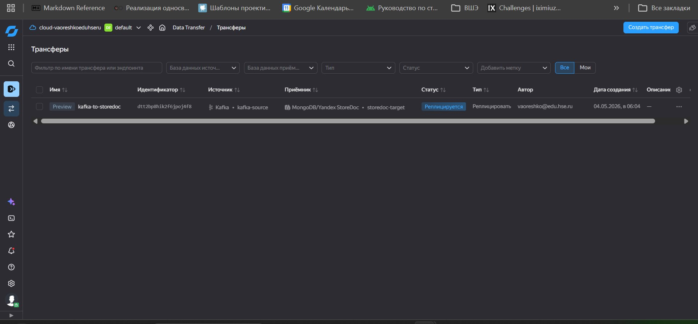 | Трансфер активирован — статус **Реплицируется** |
| 18 | 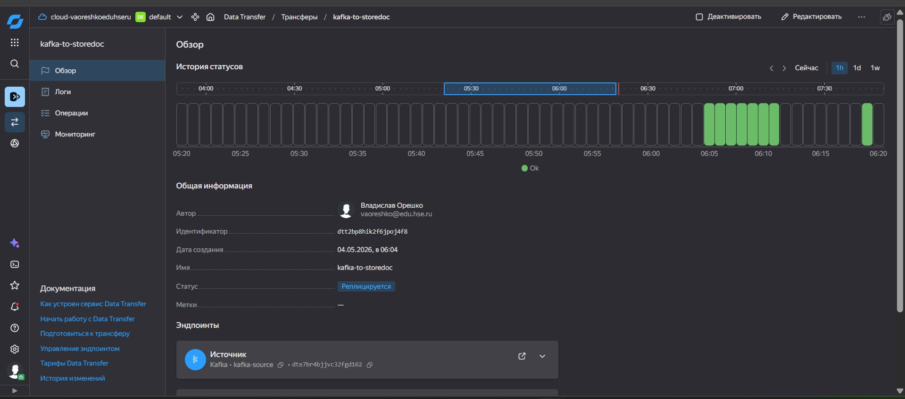 | Обзор трансфера — история зелёная, статус **Ok** |
| 19 | 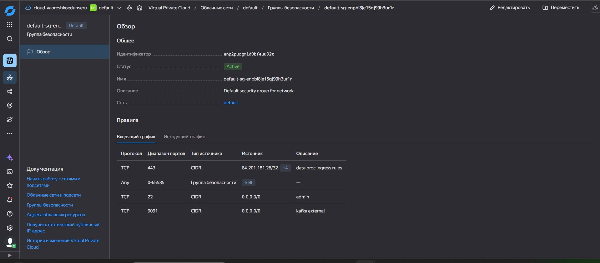 | Группа безопасности — правило для порта 9091 (внешний доступ к Kafka) |
| 20 | 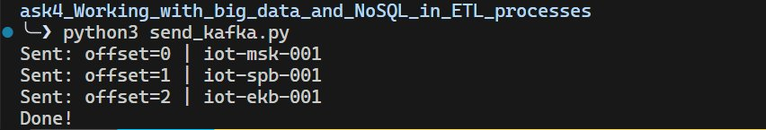 | Python producer — 3 сообщения отправлены (offset 0, 1, 2) |
| 21 | 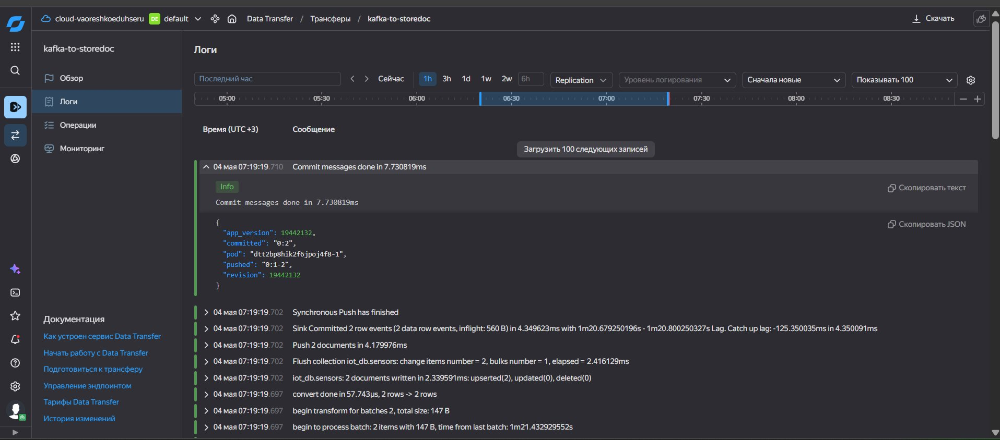 | Логи трансфера — `iot_db.sensors: 2 documents written` |
| 22 | 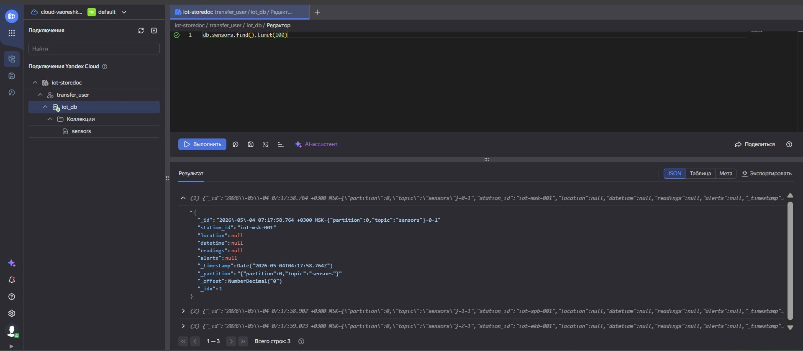 | StoreDoc — документ в коллекции `sensors` с полями `station_id` и метаданными Kafka |

### Шаг 1 – Создание кластера Managed Kafka

| Параметр | Значение |
|----------|---------|
| Имя | `iot-kafka` |
| Версия | `4.0` |
| Класс хоста | `s4a-c2-m8` (2 vCPU, 8 ГБ) |
| Кол-во брокеров | 1 |
| Зона / Подсеть | `ru-central1-b` / `default-ru-central1-b` |
| Публичный доступ | Включён |
| Топик | `sensors` (1 раздел, репликация 1) |
| Пользователь `writer` | `ACCESS_ROLE_PRODUCER` на топик `sensors` |
| Пользователь `reader` | `ACCESS_ROLE_CONSUMER` на топик `sensors` |

Для подключения извне добавлено правило в группу безопасности: TCP порт `9091`, источник `0.0.0.0/0`.

### Шаг 2 – Создание кластера Yandex StoreDoc

| Параметр | Значение |
|----------|---------|
| Имя | `iot-storedoc` |
| Версия | `8.0` |
| Класс хоста | `c3-c2-m4` (2 vCPU, 4 ГБ) |
| Зона / Подсеть | `ru-central1-b` / `default-ru-central1-b` |
| База данных | `iot_db` |
| Пользователь | `transfer_user` |

### Шаг 3 – Создание и активация трансфера

**Эндпоинт-источник** `kafka-source`: тип Kafka, кластер `iot-kafka`, топик `sensors`, пользователь `reader`, формат JSON.

**Эндпоинт-приёмник** `storedoc-target`: тип StoreDoc, кластер `iot-storedoc`, БД `iot_db`, пользователь `transfer_user`, политика очистки — «Не очищать».

**Трансфер** `kafka-to-storedoc` — тип Репликация. После нажатия «Активировать» статус сменился на **Реплицируется**.

### Шаг 4 – Отправка тестовых сообщений в Kafka

Использована библиотека `confluent-kafka` (Python). Полные команды также есть в `kafka_commands.sh` (вариант с `kcat`).

```python
from confluent_kafka import Producer

p = Producer({
    'bootstrap.servers': 'rc1b-7st62tq90h9le5nt.mdb.yandexcloud.net:9091',
    'security.protocol': 'SASL_SSL',
    'sasl.mechanism': 'SCRAM-SHA-512',
    'sasl.username': 'writer',
    'sasl.password': '***',
    'ssl.ca.location': '/usr/local/share/ca-certificates/Yandex/YandexCA.crt',
})
```

Результат отправки:

```
Sent: offset=0 | iot-msk-001
Sent: offset=1 | iot-spb-001
Sent: offset=2 | iot-ekb-001
Done!
```

### Шаг 5 – Проверка данных в StoreDoc

В WebSQL консоли StoreDoc выполнен запрос `db.sensors.find().limit(100)`.

**Результат — 3 документа в коллекции `iot_db.sensors`:**

```json
{
  "_id": "2026-05-04 07:17:58 MSK-{partition:0,topic:sensors}-0-1",
  "station_id": "iot-msk-001",
  "sensor_type": "temperature",
  "value": -2.5,
  "_timestamp": "2026-05-04T04:17:58.764Z",
  "_partition": "{partition:0, topic:sensors}",
  "_offset": 0
}
```

Данные успешно доставлены из Kafka в StoreDoc через Data Transfer.

---

## Удаление ресурсов

После выполнения задания все созданные ресурсы удалены:

```bash
yc datatransfer transfer delete kafka-to-storedoc
yc datatransfer endpoint delete kafka-source
yc datatransfer endpoint delete storedoc-target
yc managed-kafka cluster delete iot-kafka
yc managed-mongodb cluster delete iot-storedoc
yc dataproc cluster delete iot-dp-cluster
aws s3 rm s3://iot-sensors-vlad --recursive \
  --endpoint-url https://storage.yandexcloud.net
```

---

## Структура репозитория

```
Oreshko_Vladislav_task4_Working_with_big_data_and_NoSQL/
├── README.md                  ← этот файл
├── spark_etl.py               ← PySpark ETL скрипт (Вебинар 11)
├── send_kafka.py          ← Python producer для Kafka (Вебинар 12)
├── kafka_commands.sh          ← команды kcat для Kafka (Вебинар 12)
├── data/
│   └── sensors.json           ← исходный датасет (IoT метеостанции)
└── screenshots/
    ├── 01_service_account_dataproc_roles.png
    ├── 02_s3_bucket_files_uploaded.png
    ├── 03_s3_scripts_spark_etl.png
    ├── 04_dp_cluster_alive.png
    ├── 05_spark_job_creation_form.png
    ├── 06_spark_job_done.png
    ├── 07_spark_job_logs_succeeded.png
    ├── 08_s3_parquet_folders.png
    ├── 09_s3_alerts_parquet.png
    ├── 10_s3_readings_parquet.png
    ├── 11_kafka_cluster_alive.png
    ├── 12_kafka_topic_sensors_created.png
    ├── 13_kafka_users_writer_reader.png
    ├── 14_storedoc_cluster_alive.png
    ├── 15_data_transfer_endpoints_created.png
    ├── 16_data_transfer_creation_form.png
    ├── 17_data_transfer_replicating.png
    ├── 18_data_transfer_status_ok.png
    ├── 19_security_group_port_9091.png
    ├── 20_kafka_producer_sent_messages.png
    ├── 21_transfer_logs_documents_written.png
    └── 22_storedoc_document_in_collection.png
```
