# ДЗ 5: Хранение данных в облаке и Работа с облачными вычислениями

**Студент:** Орешко Владислав  
**Дисциплина:** ETL-процессы  
**Темы:** Тема 11 — Хранение данных в облаке · Тема 12 — Работа с облачными вычислениями  

---

## Часть 1. PostgreSQL → Object Storage через Data Transfer

**Задача:** перенести данные из кластера Yandex Managed Service for PostgreSQL в Yandex Object Storage с помощью сервиса Yandex Data Transfer.

### Шаги выполнения

1. Создать кластер-источник Managed Service for PostgreSQL
2. Создать эндпоинт-источник (PostgreSQL) и эндпоинт-приёмник (Object Storage)
3. Создать и запустить трансфер типа «Копирование»
4. Проверить результат в бакете Object Storage
5. Повторно активировать трансфер и проверить обновлённые данные

---

### Скриншот 1 — Кластер PostgreSQL, статус `Alive`

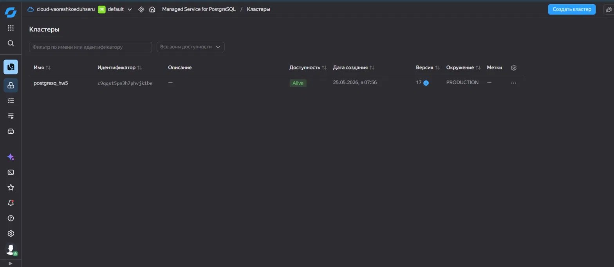

Создан кластер **postgresql_hw5** (версия 17, окружение PRODUCTION), статус — `Alive`.

---

### Скриншот 2 — SQL-редактор: таблица `x_tab` с данными

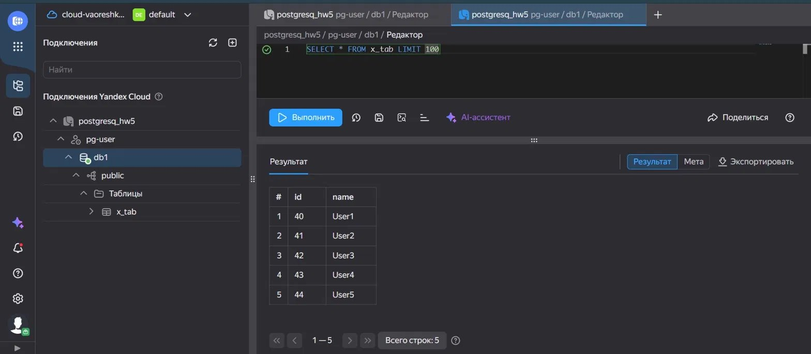

В базе `db1` создана таблица `x_tab` с 5 строками: `id` (40–44) и `name` (User1–User5).

---

### Скриншот 3 — Data Transfer: список эндпоинтов

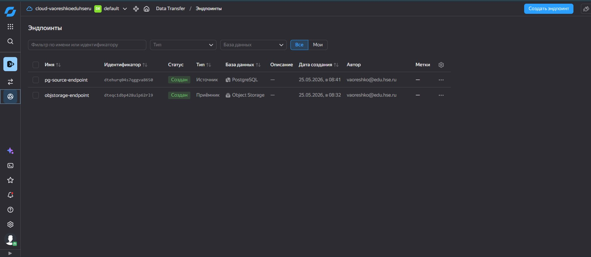

Созданы два эндпоинта:
- **pg-source-endpoint** — Источник · PostgreSQL
- **objstorage-endpoint** — Приёмник · Object Storage

---

### Скриншот 4 — Трансфер `pg-to-objstorage-transfer`, статус `Завершён` (первая активация)

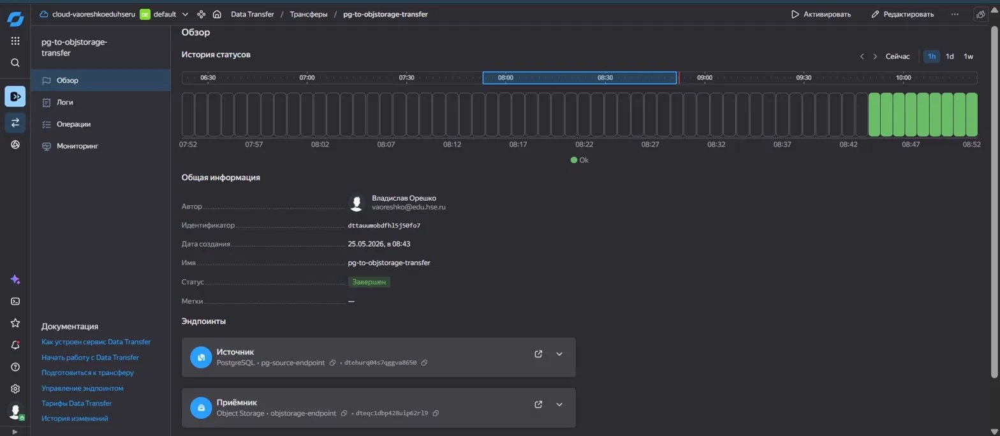

Трансфер **pg-to-objstorage-transfer** успешно завершился. Источник — `pg-source-endpoint` (PostgreSQL), приёмник — `objstorage-endpoint` (Object Storage).

---

### Скриншот 5 — Бакет Object Storage: файл `public.x_tab.csv`

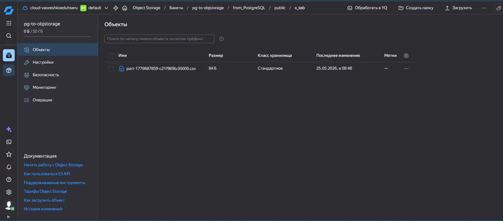

В бакете **pg-to-objstorage**, по пути `from_PostgreSQL/public/x_tab/`, появился файл `part-*.csv` размером 84 Б — данные из таблицы `x_tab` успешно выгружены.

---

### Скриншот 6 — Трансфер, статус `Завершён` (повторная активация)

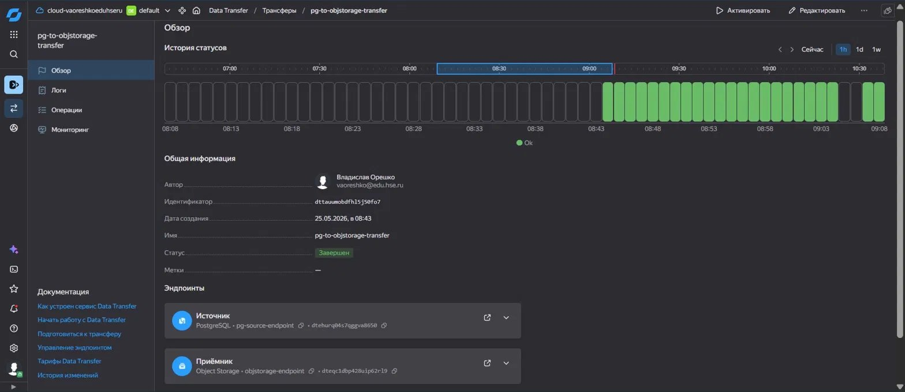

Трансфер повторно активирован и снова завершился успешно.

---

### Скриншот 7 — Обновлённый бакет: два CSV-файла после повторной активации

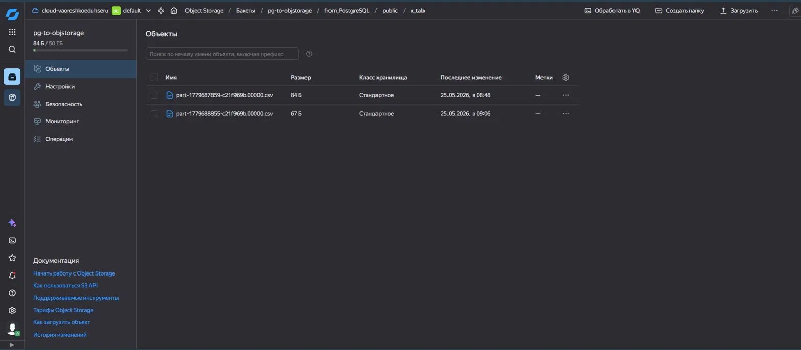

После повторной активации трансфера в папке `x_tab/` появился второй файл `part-*.csv` (67 Б) — данные перегрузились заново.

---

## Часть 2. Обработка данных через Airflow + Data Processing

**Задача:** обработать данные из Yandex Object Storage с помощью Apache Airflow, запустив PySpark-задание на кластере Yandex Data Processing (Dataproc).

### Шаги выполнения

1. Настроить сервисный аккаунт `dataproc` с необходимыми ролями
2. Подготовить бакет: разместить DAG и PySpark-скрипт
3. Создать кластер Hive Metastore
4. Создать кластер Managed Service for Apache Airflow
5. Запустить DAG `DATA_INGEST` и убедиться в успешном выполнении
6. Проверить результаты в бакете (папка `countries/`)

---

### Скриншот 1 — IAM: сервисный аккаунт `dataproc` с ролями

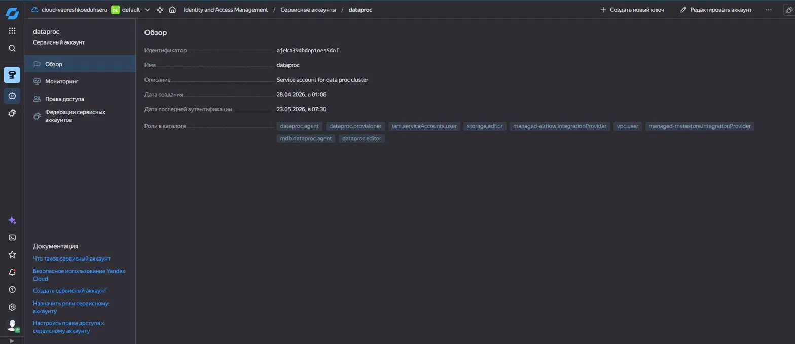

Сервисный аккаунт **dataproc** настроен с ролями: `dataproc.agent`, `dataproc.provisioner`, `iam.serviceAccounts.user`, `storage.editor`, `managed-airflow.integrationProvider`, `vpc.user`, `managed-metastore.integrationProvider`, `mdb.dataproc.agent`, `dataproc.editor`.

---

### Скриншот 2 — Бакет `airflow-dataproc`: папки `dags/`, `scripts/`, `dataproc/`, `countries/`

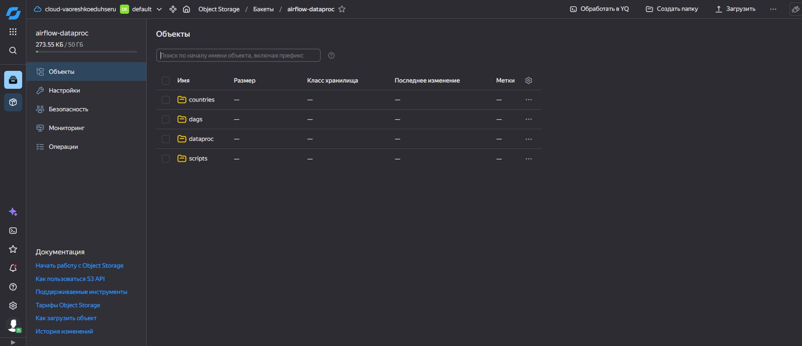

В бакете **airflow-dataproc** созданы папки: `countries`, `dags`, `dataproc`, `scripts`.

---

### Скриншот 3 — Кластер Hive Metastore, статус `Alive`

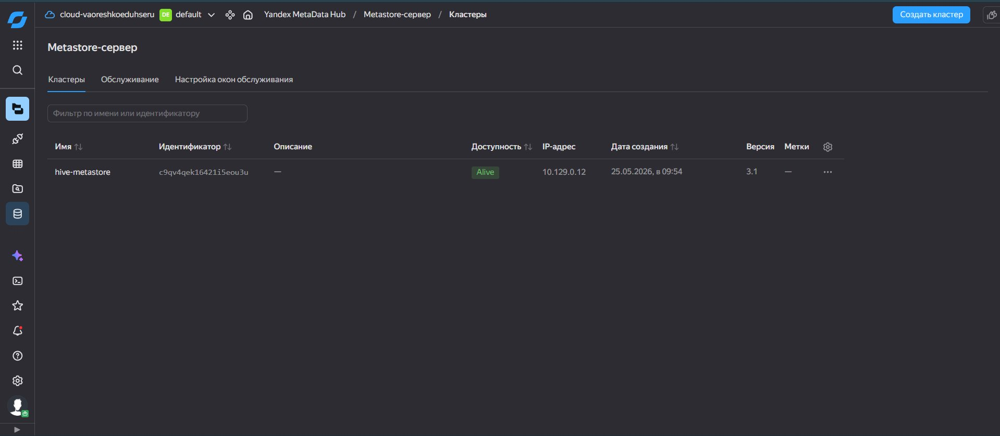

Создан кластер **hive-metastore** (версия 3.1), статус — `Alive`, IP — `10.129.0.12`.

---

### Скриншот 4 — Кластер Airflow, статус `Alive`

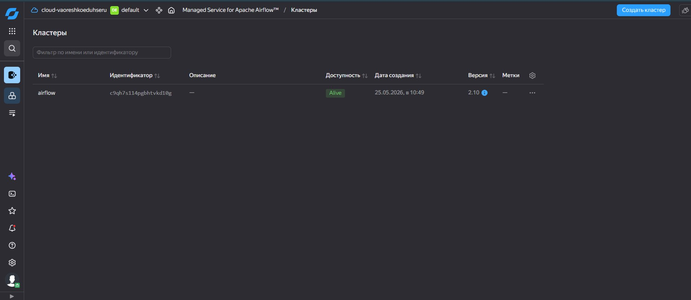

Создан кластер **airflow** (версия 2.10), статус — `Alive`.

---

### Скриншот 5 — Веб-интерфейс Airflow: DAG `DATA_INGEST` успешно выполнен

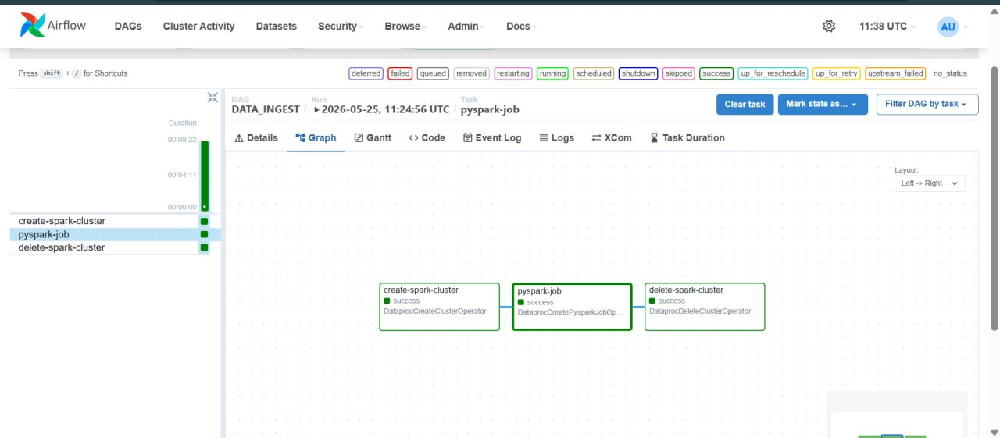

DAG **DATA_INGEST** успешно отработал. Все три задачи завершились со статусом `success`:
- `create-spark-cluster` — `DataprocCreateClusterOperator`
- `pyspark-job` — `DataprocCreatePysparkJobOp...`
- `delete-spark-cluster` — `DataprocDeleteClusterOperator`

---

### Скриншот 6 — Object Storage: папка `countries/` с результатами Spark-задания

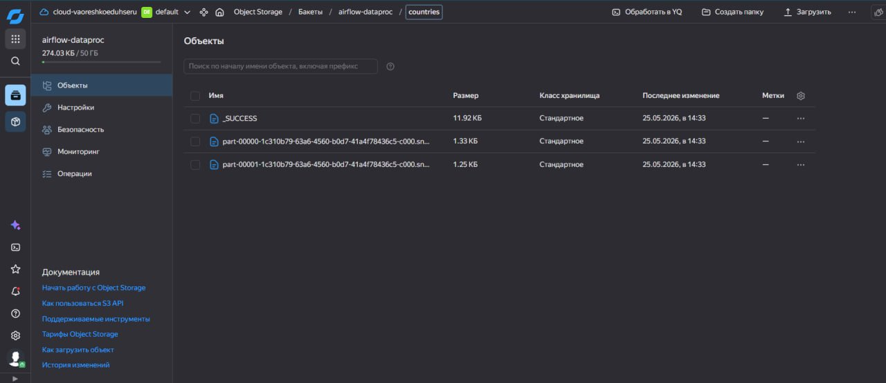

В папке `countries/` сохранились результаты PySpark-задания: файл `_SUCCESS` и два файла `.snappy.parquet`.

---

### Скриншот 7 — Содержимое parquet-файла (part-00000): Австралия

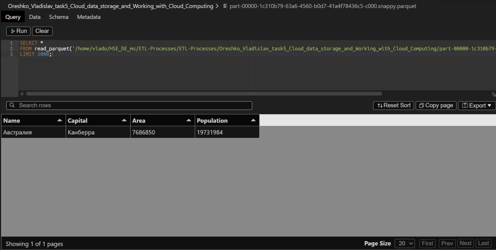

Первый parquet-файл содержит запись: **Австралия** — Канберра, площадь 7 686 850, население 19 731 984.

---

### Скриншот 8 — Содержимое parquet-файла (part-00001): Австрия

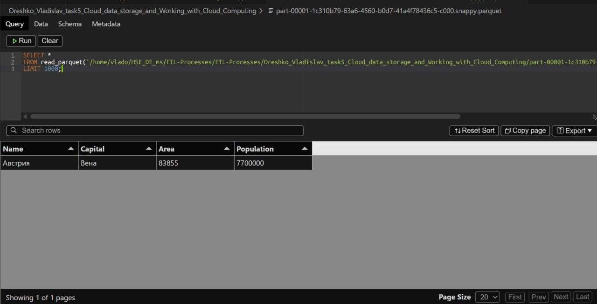

Второй parquet-файл содержит запись: **Австрия** — Вена, площадь 83 855, население 7 700 000.

---

## Итог

| Часть | Задача | Статус |
|---|---|---|
| 1 | Кластер PostgreSQL создан и работает | ✅ |
| 1 | Таблица `x_tab` заполнена данными | ✅ |
| 1 | Эндпоинты Data Transfer настроены | ✅ |
| 1 | Первая активация трансфера (Завершён) | ✅ |
| 1 | Данные появились в Object Storage | ✅ |
| 1 | Повторная активация трансфера (Завершён) | ✅ |
| 1 | Обновлённые данные в Object Storage | ✅ |
| 2 | SA `dataproc` с ролями настроен | ✅ |
| 2 | Бакет с папками `dags/`, `scripts/` подготовлен | ✅ |
| 2 | Кластер Hive Metastore создан | ✅ |
| 2 | Кластер Airflow создан | ✅ |
| 2 | DAG `DATA_INGEST` выполнен успешно | ✅ |
| 2 | Результаты сохранены в `countries/` | ✅ |
