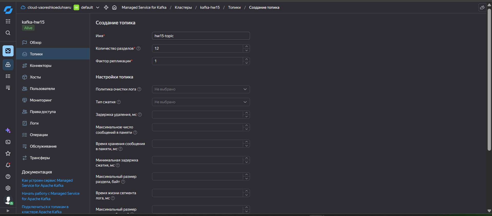
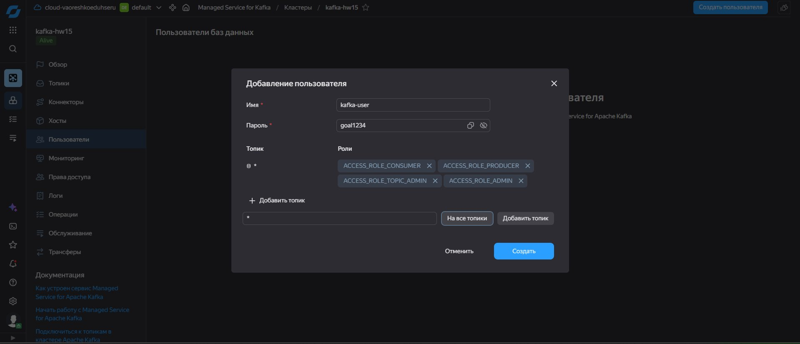
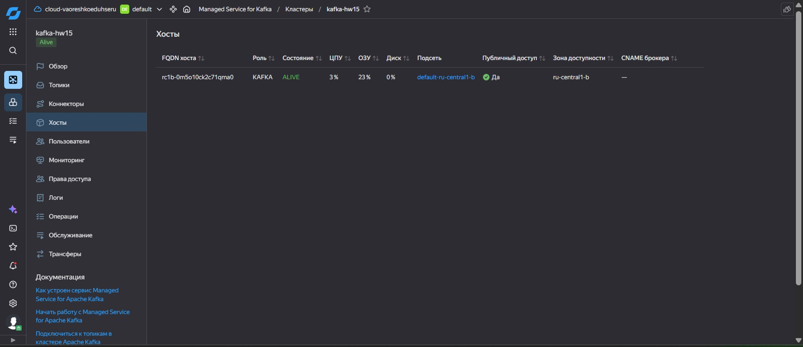
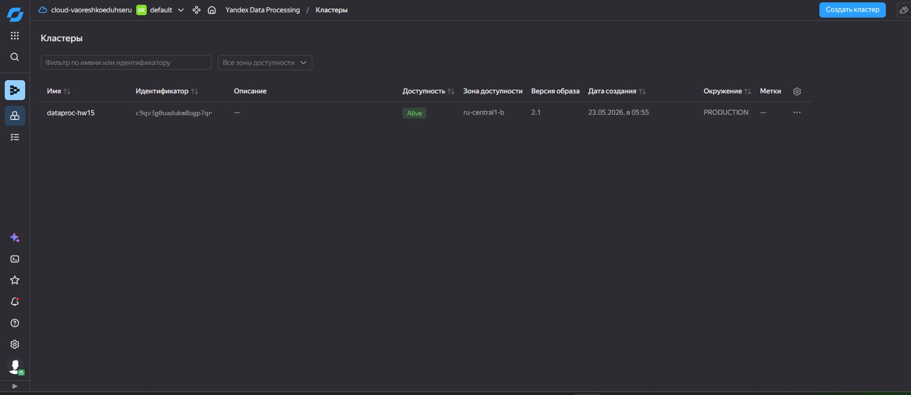
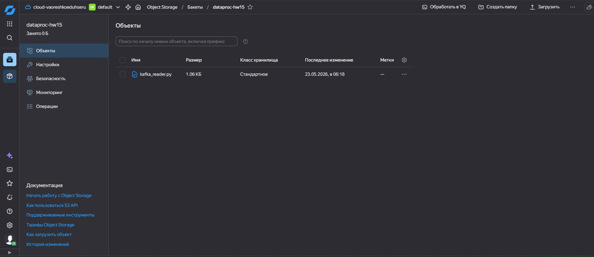
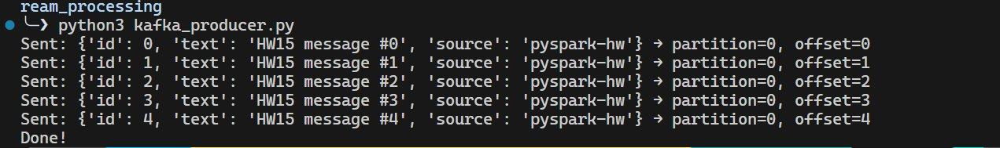
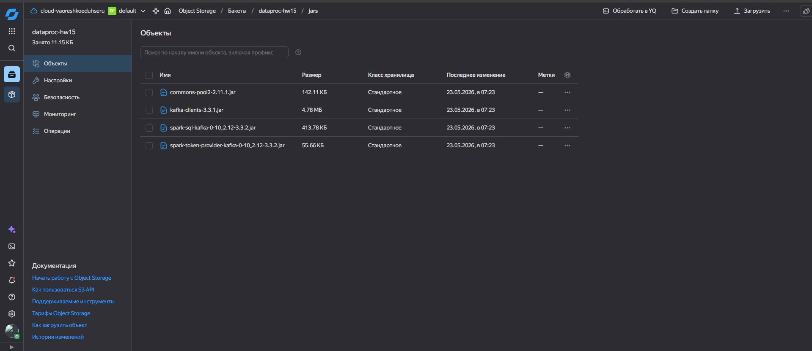
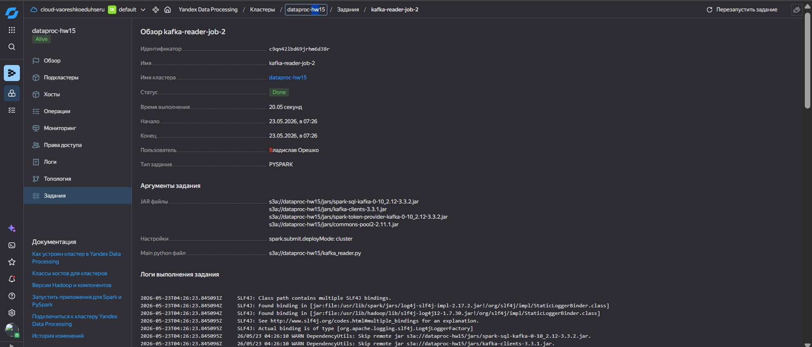
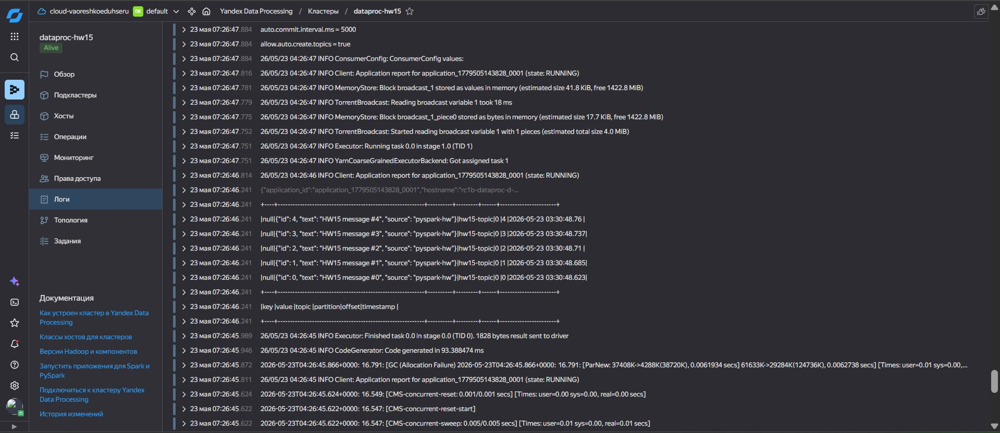
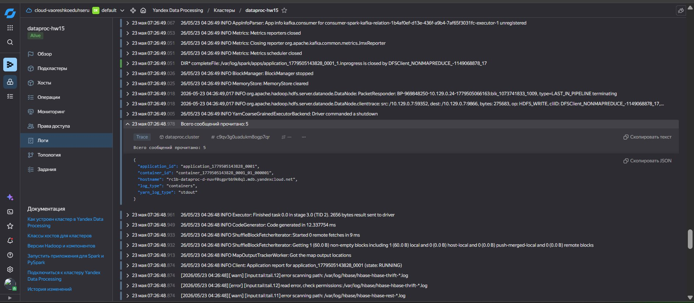

# ДЗ 6 — Потоковая обработка данных

**Дисциплина:** ETL-процессы  
**Тема:** Потоковая обработка данных  
**Студент:** Владислав Орешко  

## Цель задания

Научиться использовать Apache Kafka с помощью PySpark-заданий:
- Записать сообщения в топик Apache Kafka
- Прочитать сообщения из топика с помощью PySpark-задания

## Используемые инструменты

- **Yandex Managed Service for Apache Kafka** — управляемый Kafka-кластер
- **Yandex Data Processing** — управляемый кластер для запуска Spark-заданий
- **Yandex Object Storage** — хранение PySpark-скрипта и JAR-зависимостей

---

## Выполнение

### 1. Создание топика Kafka

Создан топик `hw15-topic` в кластере `kafka-hw15`:
- 1 партиция, фактор репликации = 1



---

### 2. Создание пользователя Kafka

Создан пользователь `kafka-user` с правами producer + consumer на все топики.



---

### 3. Kafka брокер — FQDN хоста

FQDN брокера для подключения: `rc1b-0m5o10ck2c71qma0.mdb.yandexcloud.net:9091`



---

### 4. DataProc кластер

Создан кластер `dataproc-hw15` (версия 2.1) с сервисами HDFS + YARN + SPARK.



---

### 5. PySpark-скрипт в Object Storage

Скрипт `kafka_reader.py` загружен в бакет `dataproc-hw15`.

```python
from pyspark.sql import SparkSession

KAFKA_BOOTSTRAP = "rc1b-0m5o10ck2c71qma0.mdb.yandexcloud.net:9091"
KAFKA_TOPIC = "hw15-topic"
KAFKA_USER = "kafka-user"
KAFKA_PASSWORD = "secret"

spark = SparkSession.builder.appName("KafkaHW15").getOrCreate()
spark.sparkContext.setLogLevel("WARN")

df = spark.read \
    .format("kafka") \
    .option("kafka.bootstrap.servers", KAFKA_BOOTSTRAP) \
    .option("kafka.security.protocol", "SASL_SSL") \
    .option("kafka.sasl.mechanism", "SCRAM-SHA-512") \
    .option("kafka.sasl.jaas.config",
            f'org.apache.kafka.common.security.scram.ScramLoginModule required '
            f'username="{KAFKA_USER}" password="{KAFKA_PASSWORD}";') \
    .option("subscribe", KAFKA_TOPIC) \
    .option("startingOffsets", "earliest") \
    .load()

messages = df.selectExpr(
    "CAST(key AS STRING) as key",
    "CAST(value AS STRING) as value",
    "topic", "partition", "offset", "timestamp"
)

messages.show(truncate=False)
print(f"Всего сообщений прочитано: {messages.count()}")
spark.stop()
```



---

### 6. Отправка сообщений в Kafka (Producer)

С помощью Python-скрипта отправлено 5 сообщений в топик `hw15-topic`:

```
Sent: {'id': 0, 'text': 'HW15 message #0', 'source': 'pyspark-hw'} → partition=0, offset=0
Sent: {'id': 1, 'text': 'HW15 message #1', 'source': 'pyspark-hw'} → partition=0, offset=1
Sent: {'id': 2, 'text': 'HW15 message #2', 'source': 'pyspark-hw'} → partition=0, offset=2
Sent: {'id': 3, 'text': 'HW15 message #3', 'source': 'pyspark-hw'} → partition=0, offset=3
Sent: {'id': 4, 'text': 'HW15 message #4', 'source': 'pyspark-hw'} → partition=0, offset=4
Done!
```



---

### 7. JAR-зависимости в Object Storage

Kafka-коннектор для Spark загружен вручную (Maven Central недоступен из кластера):

- `spark-sql-kafka-0-10_2.12-3.3.2.jar`
- `kafka-clients-3.3.1.jar`
- `spark-token-provider-kafka-0-10_2.12-3.3.2.jar`
- `commons-pool2-2.11.1.jar`



---

### 8. Запуск PySpark Job — статус Done

Задание `kafka-reader-job-2` успешно выполнено за **20 секунд**.



---

### 9. Результат — сообщения прочитаны из Kafka

В логах задания видна таблица с прочитанными сообщениями:



Итоговый счётчик: **Всего сообщений прочитано: 5**




## Итог

Задание выполнено успешно:
- ✅ Создан Kafka-кластер с топиком `hw15-topic`
- ✅ Отправлено 5 сообщений через Python-producer
- ✅ PySpark-задание прочитало все 5 сообщений из топика (статус **Done**)
